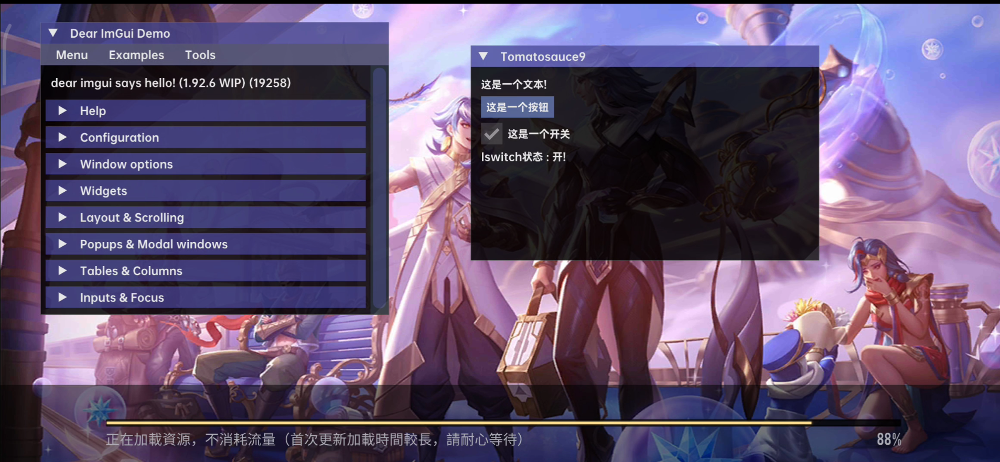
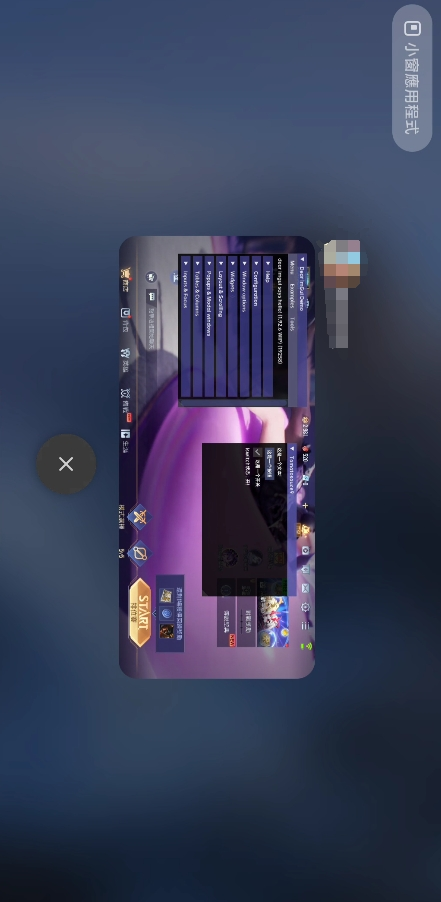

## ImGui 菜单示例 — 通过 Hook eglSwapBuffers 实现

### 项目简介
#### 本项目是一个简易示例，演示如何通过 Hook 游戏的 eglSwapBuffers 来实现 ImGui 菜单。
> #### ⚠️ 注意：如果游戏使用 Vulkan 渲染，则本项目无法生效，仅适用于 OpenGL ES 的游戏。

---

### 功能特点
- #### 使用 Hook 技术 拦截 eglSwapBuffers，在渲染帧中绘制 ImGui 菜单。
- #### 简单易用，方便在游戏中进行调试或叠加自定义 UI。

---

### 项目依赖
- [**ImGui**](https://github.com/ocornut/imgui) — 即时渲染 GUI 库，用于菜单绘制。
- [**Dobby**](https://github.com/jmpews/Dobby) — 高性能 Hook 框架，用于函数拦截。
- [**xDL**](https://github.com/hexhacking/xDL) — 动态库加载工具，用于加载游戏库和系统库。

---

### 使用说明
#### 1. 将项目编译成动态库并注入目标游戏。
#### 2. Hook 成功后，在 `eglSwapBuffers` 回调中绘制 ImGui 菜单。
#### 3. 支持基本的菜单交互和自定义绘制。

---

### 限制
#### 仅支持 OpenGL ES 渲染的游戏。
#### Vulkan 或其他图形接口的游戏不支持。

### 效果展示

